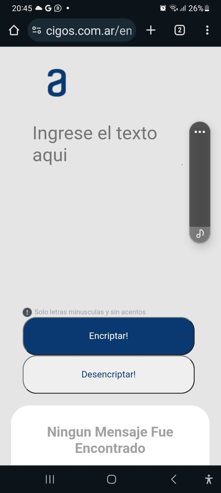

# Encriptacion Desencriptacion Version 1.0
Sistema que permite encriptar y desencriptar palabras ingresadas en un textarea y muestra el resultado en el panel derecho.
Esta diseñado para ser usado en los navegadores de escritorios , tablets y celulares.
Solo admite palabras en minusculas , no estan permitidos acentos , numeros y simbolos.
Usa las siguientes reglas claves secretas para la encriptacion :

        case 'a':
            letraMatch='ai';
            break;
        case 'e':
            letraMatch='enter';
            break;
        case 'i':
            letraMatch='imes';
            break;
        case 'o':
            letraMatch='ober'
            break;
        case 'u':
             letraMatch='ufat';
             break;

    Ejemplo: Hola - > Hoberlai

    A continuacion una captura de imagen para la version de celulares . Solo deja ingresar caracteres en minusculas. 
   

  
   

